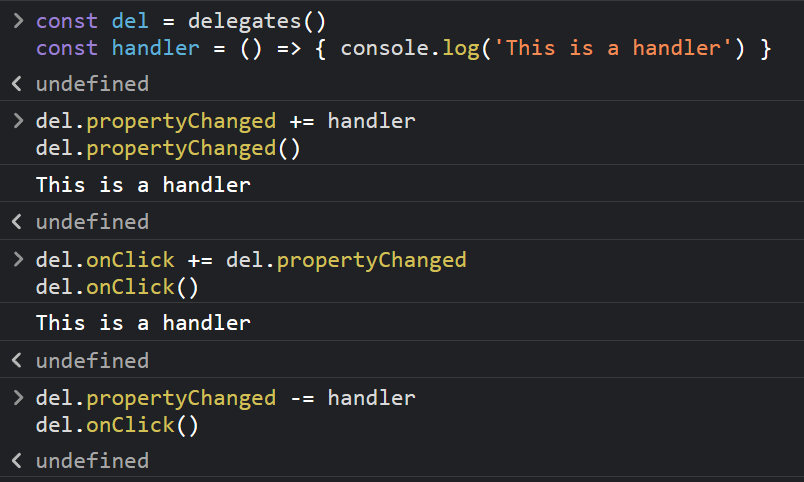

# esdelegates

Allow js using `+=`/`-=` to add or remove delegates


## Example




```js
const del = delegates()                                    
const handler = () => { console.log('This is a handler') } 
del.propertyChanged += handler                             
del.propertyChanged()                                     
// => This is a handler
del.propertyChanged -= handler                       
del.propertyChanged()                              
// ...Empty
```
